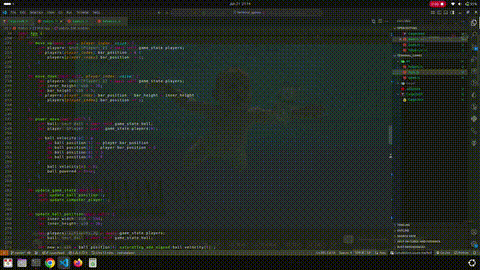

# Terminal Ping Pong 🏓

A simple, fun ping pong game playable entirely in your terminal. Built with Rust and powered by [`ratatui`](https://crates.io/crates/ratatui) for a beautifully responsive TUI (Text User Interface).

Currently, you can play against a basic AI opponent. It's fast, minimal, and runs right inside your terminal window.

## 🎥 Demo
<div style="text-align:center">

</div>

---

## ✨ Features

- 🖥️ Single-player mode vs. computer
- 🎮 Real-time terminal-based gameplay
- 🎨 Smooth and colorful UI using `ratatui`
- 🚀 Written in Rust <del>for performance and reliability</del> because I wanted to

---

## 🧑‍💻 Getting Started

### Requirements

- Rust (latest stable recommended)
- A terminal that supports ANSI escape codes

### Installation

Clone the repository and build:

```bash
git clone https://github.com/yourusername/terminal-pingpong.git
cd terminal-pingpong
cargo run --release
```

Then play directly in your terminal!

### 🎯 Controls
- Up Arrow/ Mouse scroll up: Move paddle up
- Down Arrow/ Mouse scroll down: Move paddle down
- Space: Power move ( this is for pro players ;) )
- Q: Quit

### 🛠 Tech Stack
- Language: Rust
- UI: ratatui
- Rendering: Crossterm-based backend

🚧 Roadmap / Planned Features
- [ ] 🎮 Multiplayer support — play with a friend over the network or local terminal
- [ ] 🧠 Computer difficulty levels — beginner, intermediate, expert
- [ ] 🌈 Screen saver mode — AI vs AI with endless pong as a terminal screensaver


Made with ❤️ and Rust.
